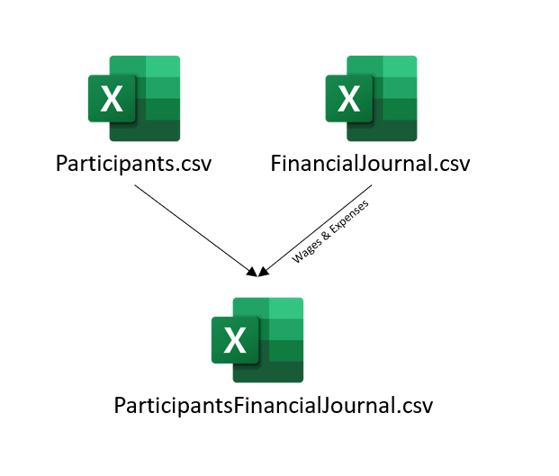

```{r setup, include=FALSE}
knitr::opts_chunk$set(echo = TRUE,
                      include = TRUE,
                      warning = FALSE,
                      message = FALSE)

# Learn more about creating websites with Distill at:
# https://rstudio.github.io/distill/website.html

```

### Introduction

The purpose of this take-home exercise, is to apply skills that were acquired in Lesson 1 and Hands-on Exercise 1 to reveal the demographic of the city of Engagement, Ohio USA by using appropriate static statistical graphics methods. The data should be processed by using appropriate tidyverse family of packages and the statistical graphics must be prepared using ggplot2 and its extensions. 

### Concept of Analysis

For the analysis, we will explore both the Participants attributes and their financial background. We will first extract required dataset from the financialjournal.csv and subsequently perform a join to merge the two csv files.

We will explore the following analysis: 

- **Bar Plot**  
  - Average Wage & Expenses of the different age group
  - Average Wage & Expenses of the different age group based on the attribute: haveKids
  
- **Violin Plot**
  - Joviality of participants against haveKids, household size, education level and interest group

- **Scatter Plot**
  - Joviality against Wages and Expenses of participants

### Installing Required Libraries

We need to install any new packages we plan to load in an R markdown document. The following libraries will be incorporated to construct the required interactive charts:  

```{r, eval=FALSE}
library(tidyverse) #for plotting and summarizing
library(ggiraph) #dynamic ggplot graphs.
library(patchwork) #combine separate ggplots into the same graphic
library(ggrepel) #provides geoms for ggplot2 to repel overlapping text labels
library(plotly) #create interactive web-based graphs via plotly's JavaScript graphing library, plotly.js
```

To install and load the new packages every time we load the R project, we will execute the following code before commencing on the analysis and constructing of graphs.  

```{r}
packages = c('tidyverse', 'ggrepel', 'ggiraph', 'patchwork', 'plotly')
for(p in packages){
  if(!require(p,character.only = T)){
    install.packages(p)
  }
  library(p,character.only = T)
}

```

### Data Preparation

#### Importing of Dataset

The dataset provided was retrieved from Vast Challenge 2022 and it consist of multiple csv files. For this exercise, we will only focus on two csv files mainly: `Participants.csv` and `FinancialJournal.csv`.  



To import the csv files, we will use the `read_csv` command instead of `read.csv` command to safeguard the integrity of the data.

``` {r, eval = FALSE}
financeJ <- read_csv(file = "rawdata/FinancialJournal.csv")
participantsD <- read_csv(file = "rawdata/Participants.csv")

head (financeJ)
head (participantsD)
```

#### Data Wrangling

Since we are only interested in yearly Wages and Expenses per participants, we will perform sum the total amount earn/spent based on the different categories and subsequently sum the different expenses together. 

``` {r, eval = FALSE}
financeJ_1 <- financeJ %>% #load the financeJ data table
  select(c("participantId","category", "amount")) %>% #choose the columns to subset
  group_by(participantId,category)%>% 
  summarise(amount = round(sum(amount),2)) %>% #sum all the amount based on their ID and Category rounding off to 2 decimal place
  pivot_wider(names_from = "category",values_from = "amount") #pivot the table to have the categories in columns instead of rows
financeJ_1[is.na(financeJ_1)] = 0 #input a 0 value to all N.A field in the data table

financeJ_2 <- financeJ_1 %>%
  mutate(Expenses = Education + Food + Recreation + Shelter + RentAdjustment) %>% #create new column to sum all the different categories of expenses
  select(participantId, Wage, Expenses)
```

Once both csv files has been cleaned, we will combine the two csv files using the `left_join` function found in `dpylr library`.

```{r, eval = FALSE}
final_list <- left_join(financeJ_2,participantsD, by = "participantId") #join the finance dataset with the participant details referencing the participantID
```

We will input a new column named agegroup which reference the participant age and insert a string based on their age.

``` {r, eval = FALSE}
age_group1 <- 18:25 #create a vector of age
age_group2 <- 26:30
age_group3 <- 31:35
age_group4 <- 36:40
age_group5 <- 41:45
age_group6 <- 46:50
age_group7 <- 51:55
age_group8 <- 56:60

final_list_1 <- final_list %>% #We will check the age of the participant and input the relevant string
  mutate(agegroup= case_when(
    age %in% age_group1 ~ "18-25",
    age %in% age_group2 ~ "26-30",
    age %in% age_group3 ~ "31-35",
    age %in% age_group4 ~ "36-40",
    age %in% age_group5 ~ "41-45",
    age %in% age_group6 ~ "46-50",
    age %in% age_group7 ~ "51-55",
    age %in% age_group8 ~ "56-60")) %>%
  select(-age)
```

``` {r, echo = FALSE}
final_list_1 <- readRDS("data/final_list_1.rds")
```
### Plotting of statistical graphs

#### Bar Chart

An interactive bar chart will be plotted to show the average wage and expenses by the different age group. 

We will first extract the average wage and expenses from the data table based on age group, and then mutate the `tooltip_text` to the data table that will be shown when hovering over the bar chart. 

``` {r, eval = FALSE}
final_list_bar <- final_list_1 %>%
  group_by(agegroup) %>%
  summarise(Wage = mean(Wage), Expenses = mean(Expenses)) %>% #reduces multiple values down to a single summary.
  mutate(
    tooltip_text = paste0(toupper(agegroup), "\n", #tooltip for Wage bar chart
                          "$", round(Wage,2) )
  ) %>%
  mutate(
    tooltip_text1 = paste0(toupper(agegroup), "\n", #tooltip for Expenses bar chart
                          "$", round(-Expenses,2) )
  )

```

``` {r, echo=FALSE}
final_list_bar <- readRDS("data/final_list_bar.rds")
```
Once the data is ready, we will use `ggplot` and `geom_col_interactive` to plot the respective graph. `geom_col_interactive` is use to construct interactive bar chart. The `ggiraph` library will be use to use the `girafe` function. We will reorder the Wage in desecending order using the reorder function. 

``` {r}
Wage_bar <- ggplot(final_list_bar, 
                           aes(x = reorder(agegroup, Wage), 
                               y = Wage,
                               tooltip = tooltip_text, data_id = agegroup #<<
                           )) +
  geom_col_interactive(color = "black", fill="#0072B2", size = 0.5) +  #<<
  theme_minimal() +
  theme(axis.text=element_text(size = 6)) +  #<<
  labs(title = "Average Wage (USD) of Ohio Population by Age Group",
       subtitle = "Data from Vast Challenge 2022"
  ) +
  ylab("") +
  xlab("") +
  coord_flip()

Expenses_bar <- ggplot(final_list_bar, aes(x = reorder(agegroup, -Expenses), y = -Expenses, tooltip = tooltip_text1, data_id = agegroup)) +
  geom_col_interactive(color = "black", fill="#0072B2", size = 0.5) +
  theme_minimal() +
  theme(axis.text=element_text(size = 6)) +
  labs(title = "Average Expenses (USD) of Ohio Population by Age Group",
       subtitle = "Data from Vast Challenge 2022"
  ) +
  ylab("") +
  xlab("") +
  coord_flip()
```

Once the bar graph has been created, we will use the `giraph` function to display the graph. We will stack the graph on top of one another using the `/` instead of `+` inside the `print` function. 

```{r}
girafe(code = print(Wage_bar / Expenses_bar), 
       width_svg = 10, height_svg = 6) %>% 
  girafe_options(opts_hover(css = "fill:cyan;"))
```

#### Wages and Expenses Pyramid 

We will use the expenses pyramid to visualise the distribution of expenses by the age group and whether the participants have kids. 

To be able to illustrate the pyramid, we will need to have negative values and use *breaks* and *labels* to redefine the axis. We will first create another data table that consist of the average wages and expenses 

``` {r, eval = FALSE}
final_pyramid <- final_list_1 %>%
  group_by(agegroup,haveKids) %>%
  summarise(Wage = mean(Wage), Expenses = mean(Expenses)) %>%
  mutate(Wage = ifelse(haveKids, -Wage, Wage), Expenses = ifelse(haveKids,Expenses,-Expenses))
```

```{r, echo=FALSE}
final_pyramid <- readRDS("data/final_pyramid.rds")
```

We will now plot the pyramid chart using `ggplot` and `geom_col_interactive()`. `Girafe` will be use to stack the two charts above one another.

``` {r}
expenses_chart <- ggplot(final_pyramid, aes(x = Expenses, y = agegroup, fill = haveKids, tooltip = ifelse(haveKids == FALSE,round(Expenses,2),round(-Expenses,2) ))) +
  geom_col_interactive() +
  scale_x_continuous(breaks = seq(-30000, 30000, 10000), 
                     labels = paste0("$",as.character(c(seq(30, 0, -10), seq(10, 30, 10))),"k")) +
  labs (x = "Annual Average Expenses (USD)", y = "Age Group", title='Ohio Annual Average Expenses based on Age Group') +
  theme_bw() +
  theme(axis.ticks.y = element_blank()) +
  scale_fill_manual(values = c("TRUE" = "lightblue", "FALSE" = "lightpink"))

wages_chart <- ggplot(final_pyramid, aes(x = Wage, y = agegroup, fill = haveKids, tooltip = ifelse(haveKids == FALSE,round(Wage,2),round(-Wage,2) ))) +
  geom_col_interactive() +
  scale_x_continuous(breaks = seq(-60000, 60000, 30000), 
                     labels = paste0("$",as.character(c(seq(60, 0, -30), seq(30, 60, 30))),"k")) +
  labs (x = "Annual Average Wage (USD)", y = "Age Group", title='Ohio Annual Average Wages based on Age Group') +
  theme_bw() +
  theme(axis.ticks.y = element_blank()) +
  scale_fill_manual(values = c("TRUE" = "lightblue", "FALSE" = "lightpink"))

girafe(code = print(wages_chart/expenses_chart), 
       width_svg = 12, height_svg = 7)
```

#### Interactive Scatter Plot

We will be using the scatter plot to examine the relationship between the participants which have kids on their expenses and wages in relation to their joviality. `plotly` will be used to construct the interactive scatter plot. We will also use `scale_x_continuous` to to set the scale limit of the x axis.

``` {r}
wages_scatter <- final_list_1 %>%
  filter (haveKids == TRUE) %>%
  ggplot(aes(Wage,joviality, color = interestGroup)) +
  geom_point() +
  facet_wrap(~ educationLevel) +
  theme(
    strip.text.x = element_text(margin = margin(2, 0, 2, 0))
  ) +
  scale_x_continuous(name ="Average Wage (USD)", 
                    limits =c(0,60000))
ggplotly(wages_scatter)
```

``` {r}
expenses_scatter <- final_list_1 %>%
  filter (haveKids == TRUE) %>%
  ggplot(aes(-Expenses,joviality, color = interestGroup)) +
  geom_point() +
  labs (title = 'Participants Expenses by Jovaility', y = 'Joviality', x = 'Expenses (USD)') +
  facet_wrap(~ educationLevel) +
  theme(
    strip.text.x = element_text(margin = margin(2, 0, 2, 0))
  )
ggplotly(expenses_scatter)
```

#### Violin Plot

A violin plot combines the same visualisation a box plot and a density plot. Therefore it allows to understand with a blink of an eye the minimum, max, 1st quartile, mean, median, 3rd quartile and frequency of multiple variables in a data frame. The shape of the violin density plot expresses the frequency of the observations. We will use the violin plot to analyse the relationship between joviality and the various categorical data. 

`plotly` will be used to construct the interactive violin plot.

We will first plot the violin plot of Education Level against Joviality.

``` {r}

EL_plotly <- plot_ly(final_list_1, x = ~educationLevel,
    y = ~joviality,
    split = ~educationLevel,
    type = 'violin', box = list(
      visible = T
    ),
    meanline = list(
      visible = T
    )) %>%
  layout (
    title = "Violin Plot of Education Level against Joviality"
  )
EL_plotly
```

Next, we will plot the violin plot of householdSize against Joviality.

``` {r}

HS_plotly <- plot_ly(final_list_1, x = ~householdSize,
    y = ~joviality,
    split = ~householdSize,
    type = 'violin', box = list(
      visible = T
    ),
    meanline = list(
      visible = T
    )) %>%
  layout (
    title = "Violin Plot of Household Size against Joviality"
  )
HS_plotly
```

Lastly, we will plot the haveKids against joviality.

``` {r}

HK_plotly <- plot_ly(final_list_1, x = ~haveKids,
    y = ~joviality,
    split = ~haveKids,
    type = 'violin', box = list(
      visible = T
    ),
    meanline = list(
      visible = T
    )) %>%
  layout (
    title = "Violin Plot of HaveKids against Joviality"
  )
HK_plotly
```

### Insights from Analysis

We observed that the *older age group* tend to have the *highest average expenses* but *lower average wage*. This could be due the need to spend more on recreational activities and/or shelter. From the scatter plot, we observed that there is no relation between joviality against expenses and wages. This could mean that joviality might be affected by other factors. Lastly, from the violin plot we observed that there are more *Graduates* that falls in the higher Joviality zone compared to the other educational level. Participants who have kids also express more joviality despite having almost equal *mean* and *median* in their joviality.